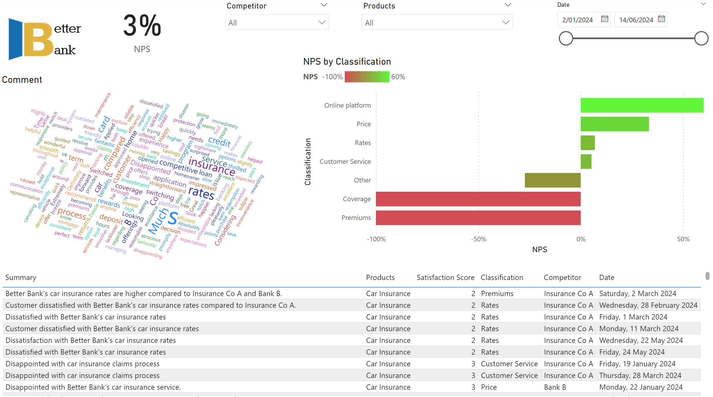

# Customer Insights demo with Azure OpenAI GPT
Use Azure Open AI models to summarise and extract insights from customer feedback and visualise in PowerBI.

# Setup
The following steps are required to setup the solution.

## Azure OpenAI Service
Edit the .env file with your Azure Open AI Service details

## Source data
The CustomerFeedback.csv file contains the feedback data. Replace with your own data, or generate sythetic data using a prompt  such as this

---

Generate me a list of 25 customer feedback comments ranging from horrible to amazing service for a banking and insurance company, Better Bank, in csv format. Include these 3 fields;   
  
1. Date (random date from January to March 2024)  
2. Comment - Limit to 100 words. The comment should include mention of a competitor to Better Bank such as Bank A, Bank B or Insurance Co A. Also include mention of a banking or insurance product such as home loans, car insurance, credit cards or term deposit.  
3. A satisfaction score from 0-10. Don't include the score in the comment field

---

Note the above prompt is a suggestion only. You can generate your own data as required. For this demo, the input file needs the following columns: 
 - ID - A unique identifier for the feedback 
 - Date - Date for the feedback comment
 - Comment - The raw comment
 - Score - A score from 1-10. In the PowerBI solution, we will post-process this to add a Net Promotor Score using the standard technique of *Promoters (9 or 10) - Dectractors (0-6) / Total responses*

## Edit and execute code
The SummariseFeedback.ipynb file contains the code to generate the summary. It uses Azure Open AI (AOAI) calls to extract:
 - Summary - A 50 word summary of the feedback
 - Competitors - Mentions of competitors in the feedback. Adjust the prompt as appropriate to include relevant competitors as a suggestion
 - Products - Mentions of products in the feedback. Adjust the prompt as appropriate to include relevant products as a suggestion
 - Classification - Classifies the comment into things like Wait time, Price, rates etc. Adjust the prompt as appropriate

## PowerBI
The CustomerInsights.pbix file contains the PowerBI report. Edit the data source to point to the output file from the Jupyter notebook which by default is written to ./output/AOAI-FeedbackSummary.csv

Adjust the Power BI dashboard as required to suit your needs. A sample of what the dashboard looks like is shown below

